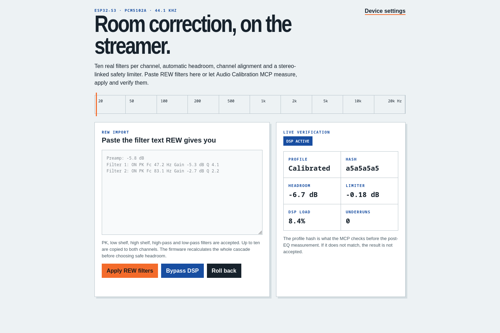

<div align="center">


# AirPlay ESP32 — Calibrated

**A tiny AirPlay 2 streamer for ESP32-S3 + PCM5102A, with room correction that REW and an Audio Calibration MCP can actually control.**

[](platformio.ini)
[](docs/calibration-dsp.md)
[](main/Kconfig.projbuild)
[](LICENSE)

[Calibration DSP](#the-calibration-path) · [Build it](#build-it) · [REW + MCP](#rew-and-audio-calibration-mcp) · [Upstream](https://github.com/rbouteiller/airplay-esp32)

</div>

This is my audiophile-focused fork of [rbouteiller/airplay-esp32](https://github.com/rbouteiller/airplay-esp32). The upstream project already does the hard, unglamorous work: AirPlay 2, ALAC/AAC decoding, multi-room timing, Wi-Fi setup, OTA updates and a solid ESP-IDF audio pipeline.

This fork keeps that foundation and adds the part I wanted for a cheap ESP32-S3 + PCM5102A box: a real, measurable calibration target. No magic audiophile dust. Measure the room, make conservative corrections, apply them to the streamer, then measure again and keep the profile only if it is actually better.

> **Project status:** the full DSP/control stack builds for the exact ESP32-S3 N16R8 target and has been exercised over AirPlay on hardware. The DAC/amp listening test, long-run load test and multi-room timing check still need the analog hardware connected.



## Why this fork exists

The PCM5102A is a good, simple I²S DAC, but it has no onboard DSP. A fixed bass/mid/treble control is not enough for room correction, and EQ that clips to 16-bit before its limiter is worse than it looks on a graph.

This fork uses a different signal path:

```text
AirPlay decode → float preamp → 10-band PEQ L/R → gain / delay / polarity
               → AirPlay volume → stereo look-ahead limiter
               → TPDF dither → 24-bit audio in 32-bit I²S slots → PCM5102A
```

The important bit is where quantization happens: the filters, channel alignment, volume and limiter all run in float. The signal is clamped and converted back to PCM only once, at the I²S boundary.

## The calibration path

- **10 true filters per channel** — PK, low shelf, high shelf, high-pass and low-pass, each with frequency, gain and Q.
- **Independent left/right correction** — gain, delay and polarity live beside each channel's filters.
- **Automatic headroom** — firmware evaluates the combined cascade at 512 log-spaced frequencies. Overlapping boosts count; it does not just subtract the largest slider value.
- **Stereo-linked look-ahead limiter** — 0.5–5 ms look-ahead, configurable ceiling and release, with one gain envelope for both channels.
- **AirPlay sync awareness** — active limiter look-ahead is added to the reported output latency instead of silently shifting multi-room playback.
- **Apply/verify identity** — every accepted profile gets a stable hash so an MCP can prove the filter set under test is the one it sent.
- **Useful telemetry** — limiter reduction, clipped-sample count, DSP load, output underruns, processed frames and fixed DSP latency.
- **Profiles without pops** — eight named NVS slots and a 50 ms transition when profiles or bypass state change.
- **Measurement mode** — locks a known software volume, disables loudness and rejects a stale profile hash.
- **Reliability view** — stream format, PTP state, RTP gaps, decoder resets, crash count, PSRAM, underruns and OTA validation state.
- **Home Assistant discovery** — optional trusted-LAN MQTT telemetry and controls.
- **One-step rollback** — the previous profile is saved in NVS before a new one becomes active.

The saved profile boots bypassed until you deliberately apply one. A firmware upgrade should not quietly change the sound.

## Hardware

The basic build is deliberately boring:

| Part | Job |
| --- | --- |
| ESP32-S3 DevKit | AirPlay receiver and DSP |
| PCM5102A board | I²S DAC |
| Amplifier or powered speakers | The part that makes noise |
| Stable USB supply | Do not debug audio on a terrible power supply |

Default ESP32-S3 pin mapping:

| PCM5102A | ESP32-S3 |
| --- | ---: |
| SCK / MCLK | GPIO 8 |
| BCK | GPIO 11 |
| LCK / WS | GPIO 13 |
| DIN | GPIO 12 |
| GND | GND |

<p align="center">
  
  
  
</p>

## Build it

You need PlatformIO and a recursive clone because the upstream display components use submodules.

```bash
git clone --recursive https://github.com/daredoole/airplay-esp32.git
cd airplay-esp32
pio run -e esp32s3 -t upload
pio run -e esp32s3 -t uploadfs
```

Join the temporary setup network, give the receiver your Wi-Fi credentials, then open its IP address. The **Calibration DSP** button appears when the firmware reports DSP support.

This fork's hardware target is the **ESP32-S3 N16R8**: 16 MB flash and 8 MB octal PSRAM. The firmware creates a random API token on first boot and prints it once over USB. If you miss it, hold the physical **BOOT** button and use **Hold BOOT + Reveal** in the web UI. Read-only status and first-time Wi-Fi setup remain open.

The default output stays at **44.1 kHz**, AirPlay's native rate, so the PCM5102A path does not resample normal AirPlay audio.

## REW and Audio Calibration MCP

There are two ways to load a correction.

For a human, export/copy REW's generic filter text, open `/dsp`, paste it, and select **Apply REW filters**. The importer understands common `PK`, `LS`, `HS`, `HP/HPF` and `LP/LPF` lines and copies up to ten filters to both channels.

For automation, the ESP32 is a native target rather than a file you manually shuttle around:

```text
REW repeated L/R measurements
        ↓
Audio Calibration MCP proposes conservative filters
        ↓
GET capabilities → backup → PUT profile → verify profile hash
        ↓
REW post-EQ measurement
        ↓
keep if better · rollback if worse
```

| Endpoint | Purpose |
| --- | --- |
| `GET /api/dsp/capabilities` | Negotiate sample rate, filter count/types, delay and limiter support |
| `GET /api/dsp/profile` | Read the exact active profile, effective preamp and hash |
| `PUT /api/dsp/profile` | Validate, back up, apply and persist a versioned profile |
| `POST /api/dsp/rew` | Import plain REW filter text directly |
| `POST /api/dsp/bypass` | Runtime A/B comparison without deleting the profile |
| `POST /api/dsp/rollback` | Restore the last saved profile |
| `GET /api/dsp/metrics` | Read limiter, clipping, CPU, underrun and latency telemetry |
| `GET /api/dsp/profiles` | List eight flash-backed profile slots |
| `POST /api/dsp/measurement` | Lock measurement volume and verify the profile hash |
| `GET /api/audio/health` | Read stream, timing, memory and crash diagnostics |
| `POST /api/audio/test-tone` | Run a bounded low-level channel/output check |
| `PUT /api/mqtt/config` | Configure Home Assistant MQTT discovery |

The complete payload contract and validation limits are in [the calibration DSP reference](docs/calibration-dsp.md). A ready-to-edit payload lives at [examples/dsp-profile.json](examples/dsp-profile.json).

> Mutating requests require `X-AirPlay-Token` or `Authorization: Bearer …`. The web server is still HTTP, so keep it on a trusted LAN and never expose it directly to the internet.

## What stays from upstream

- AirPlay 2 discovery and playback from iPhone, iPad and Mac
- ALAC and AAC decoding
- PTP-based multi-room synchronization
- Captive-portal setup, web configuration and OTA updates
- Optional Bluetooth A2DP on classic ESP32 targets
- W5500 Ethernet, displays, hardware buttons and supported amplifier boards
- TAS57xx/TAS58xx hardware-DSP support for boards that use those chips

The new software calibration path is intentionally limited to standard I²S builds such as ESP32-S3 + PCM5102A. It does not pretend the TAS58xx fixed-frequency gain page is the same thing as a true Fc/Gain/Q PEQ.

## Sensible next steps

Connect the PCM5102A and amplifier, confirm pinout and channel polarity, then run a repeatable pre/post REW sweep. After that: long-run AirPlay load testing and multi-room latency validation. Giant FIR correction can wait; ten careful IIR filters remain the better trade for this hardware.

## Credits and license

This fork exists because [rbouteiller/airplay-esp32](https://github.com/rbouteiller/airplay-esp32) exists. It also builds on work from [Shairport Sync](https://github.com/mikebrady/shairport-sync), [openairplay/airplay2-receiver](https://github.com/openairplay/airplay2-receiver) and Espressif's ESP-IDF ecosystem.

**Non-commercial use only.** See [LICENSE](LICENSE). This is an independent project, is not affiliated with Apple, and comes with no warranty.
