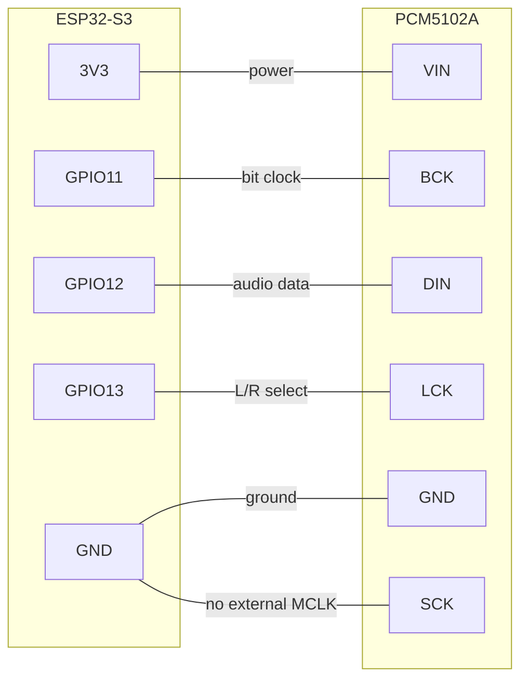
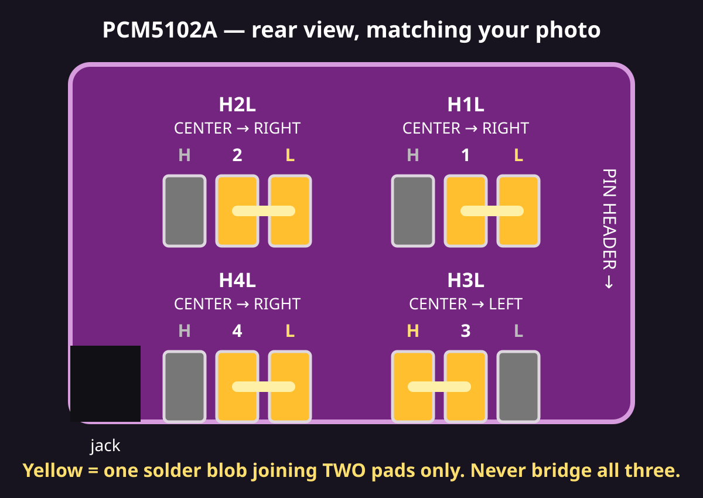

# Assembly

The tested build uses six short jumper wires between the ESP32-S3 and PCM5102A.
The DAC's four mode pads may need small solder bridges before it will produce sound.

## Step 1 — Prepare the ESP32

The pins on **one side** of the ESP32 need to be removed, or simply not soldered on, so
the assembly fits inside the 3D-printed case. Only the side carrying GPIO11–GPIO14 needs
pins.

If your board arrived with pins already soldered on both sides, carefully desolder or clip
the pins on the opposite side.

## Step 2 — Plug the DAC onto the ESP32

Take a **female 2.54 mm pin header** (6 pins) and push it onto the ESP32 pins on the
GPIO11–14 side. Then insert the PCM5102A into the female header from the other side.

The connections made through the header are:

| ESP32-S3 pin | PCM5102A pin | Function |
| --- | --- | --- |
| 3V3 | VIN | Power for the DAC |
| GPIO11 | BCK | Bit clock (audio timing) |
| GPIO12 | DIN | Audio data |
| GPIO13 | LCK | Left/right channel select |
| GND | GND | Shared electrical ground; any ESP32 pin marked GND works |
| GND | SCK | PCM5102A does not require an external master clock |

!!! warning "Do not use 5VIN or GPIO14"

    On the tested YD-ESP32-S3 N16R8, `5VIN` is a power input. Use `3V3` for the
    DAC. GPIO14 is a signal pin, not ground; use a pin physically marked `GND`.

## Step 3 — Set the DAC solder pads

Set **H1L, H2L, H3H, H4L**. Each jumper has three pads: bridge the center pad
to only the indicated H or L side. Never solder all three together.

H3 is the `XSMT` mute control. H3H holds it high so audio is enabled; the
firmware's configurable track-transition fade suppresses skip pops in software.

## Step 4 — Check the result

Your assembly should look like this:

<figure markdown>
  { width="200" }
  <figcaption>Front</figcaption>
</figure>

<figure markdown>
  { width="200" }
  <figcaption>Back</figcaption>
</figure>

<figure markdown>
  { width="150" }
  <figcaption>Side</figcaption>
</figure>

The PCM5102A sits on top of the ESP32 with the 3.5 mm audio jack sticking out the end.
Plug a USB-C cable into the ESP32 for power.

## Step 5 — Print the case (optional)

A 3D-printable case is provided: [`boite-esp32.stl`](../assets/boite-esp32.stl). Print it
with standard PLA settings. The case is designed for an assembly with pins on one side
only, as described in step 1.

## Next

Head to [Flash the firmware](flashing.md).
